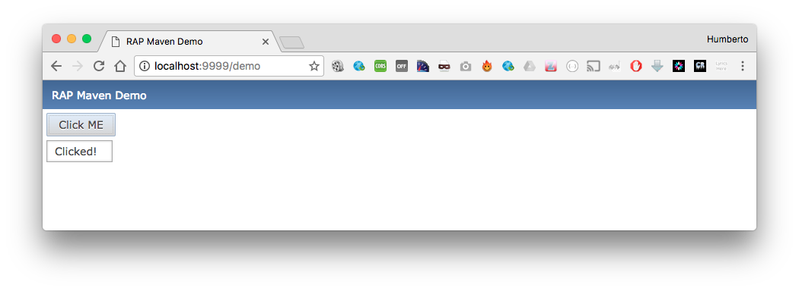

# Java EE con RAP

Aplicación Java Web usando RAP (Remote Application Platform).


## Prerequisitos

1. Maven 3+
2. Java 8+

## Como correr

1. Clon

	```
	git clone https://github.com/humbertodias/java-eclipse-rap-demo.git
	```

2. Entrar en la carpeta

	```
	cd java-eclipse-rap-demo
	```

3. Correr 
	
	### http/1
	
	```
	mvn jetty:run -Djetty.http.port=9999
	```
	
	ou
	
	### http/2
	
	```
	mvn -f pom.http2.xml jetty:runforked
	```
	
	
	```
	[INFO] Started ServerConnector@715b886f{HTTP/1.1,[http/1.1]}{0.0.0.0:9999}
	[INFO] Started @25039ms
	[INFO] Started Jetty Server
	[INFO] Using Non-Native Java sun.nio.fs.PollingWatchService
	[WARNING] Quiet Time is too low for non-native WatchService [sun.nio.fs.PollingWatchService]: 1000 < 5000 ms (defaulting to 5000 ms)
	```
	
4. Por último, en su navegador

	### http/1

	[http://localhost:9999/demo](http://localhost:9999/demo)

	### http/2

	[https://localhost:8444/demo](https://localhost:8444/demo)


# Salida




## Referencias

1. [RAP Remote Application Platform](http://www.eclipse.org/rap/)
2. [Jetty Maven Plugin](http://www.eclipse.org/jetty/documentation/current/jetty-maven-plugin.html)

